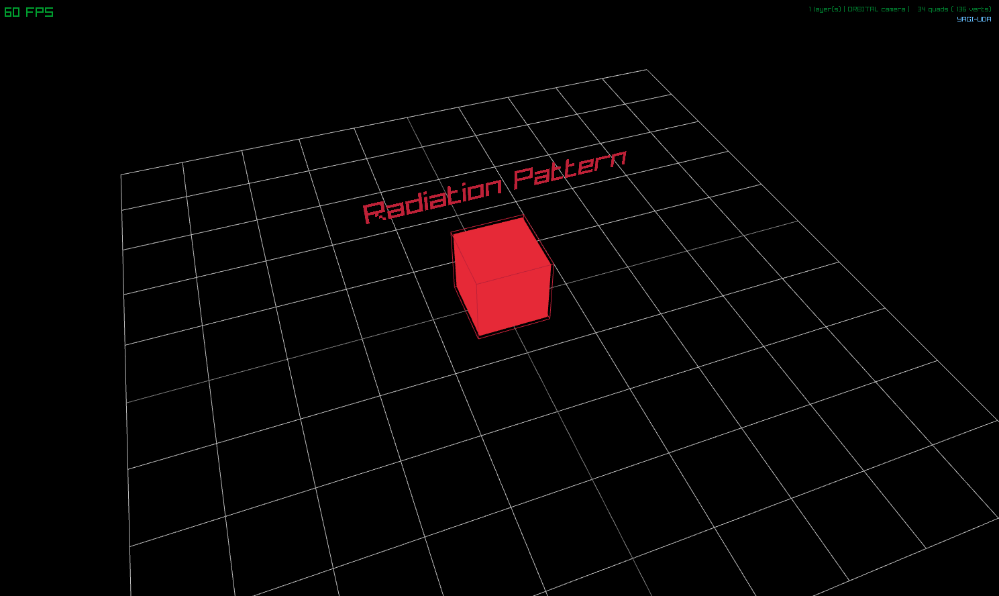

# openEM
A terminal tool that intakes key parameters of an antenna and simulates the RF pattern using Maxwell's equations. The graphics simulation was built using raylib.

## How to use openEM:
- Define all the necessary simulation parameters in simconfig.json
- Make a build/ folder and use cmake to build the necessary files
- Inside build/, use make to create a binary file
- Run it using the ./openEM command inside build/

## Solver:
A FDTD (Finite-Difference Time-Domain) solver was used.The time derivative was approximated using central difference. The wave equation was taken in a discrete time domain, and used in a time-stepping formula.

## Current State

# TODO
- [ ] Implement antenna geometry on the solver
- [ ] Implement the solver and output an actual radiation pattern
- [ ] Include automatic meshing from sim_config.json parameters for common antenna types
- [ ] Allow for importing .stl antenna files
- [ ] Include a way to easily define the feed location
